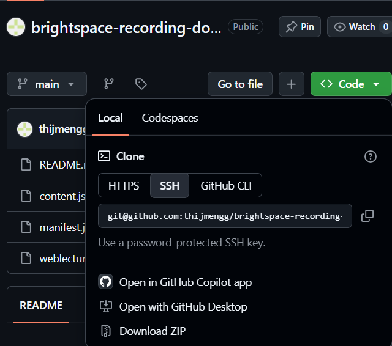
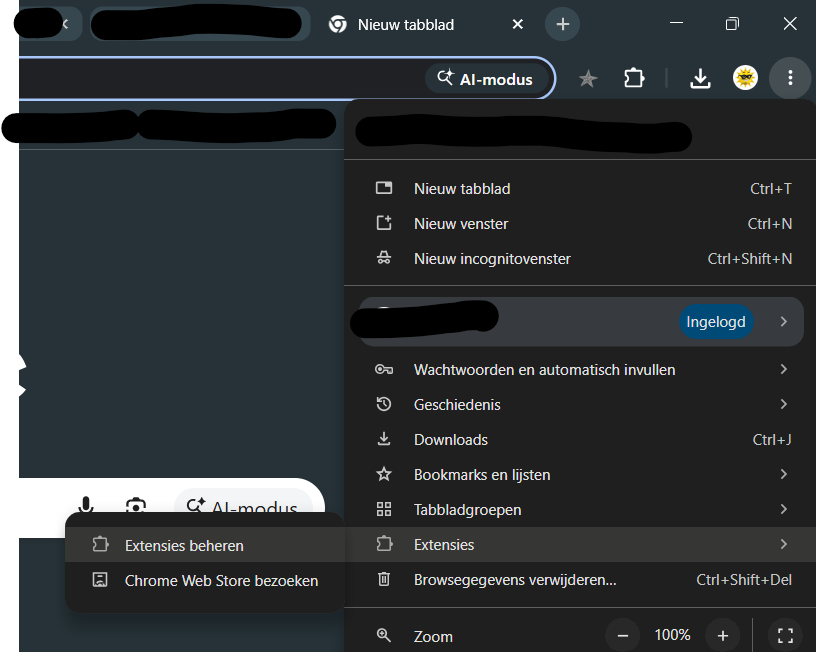

# Brightspace lecture recordings download extension
Tool to easily download your lecture recordings in MP4 format. To watch during traveling or other places where no connection is available. 

<b>You are yourself responsible for asking permission to download lectures. Distributing of content without explicit consent of your teachers is never allowed. Please keep this in mind when using this tool / Je bent zelf verantwoordelijk voor het vragen van toestemming voor het downloaden van je lectures. Verspreiden van content zonder expliciete toestemming is nooit toegestaan. Houd dit in gedachte wanneer je deze tool gebruikt. </b>

# Working universities en schools / Werkende universiteiten en scholen
- Radboud Universiteit uit Nijmegen / Radboud University from Nijmegen

# How to install/Hoe installeer je dit?
## Non-CS Students (most people)
1. Check if your school/university is listed above
2. Click on 'code' and then 'Download ZIP'
    
3. Click on manage extensions

4. 

# How to contribute/Hoe werk je mee?
As this may be used by all students from across the Netherlands, it's main focus is Computer Science Students that are willin to change the hardcoded 

Since everyone from 

# AI Contribution / AI gebruik

